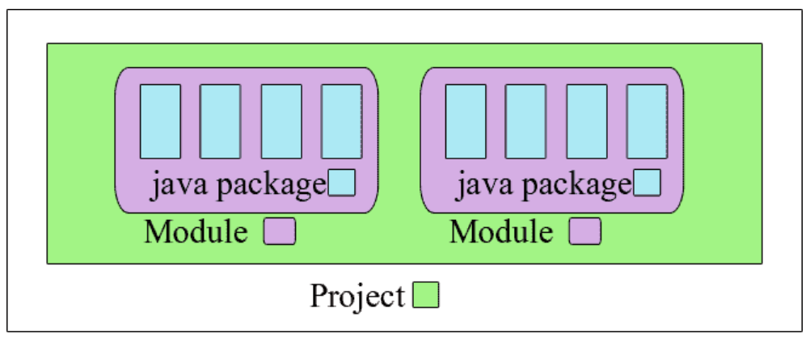

# JDK 9

## Overview

JDK 9 is released on September 22, 2017.

## Important Enhancements and Changes

### Java Platform Module System

Java Platform Module System, a new kind of Java programing component, the module, which is a a uniquely named, reusable group of related packages, as well as resources (such as images and XML files) and a module descriptor。

模块化系统，简单来说，你可以将一个模块看作是一组唯一命名、可重用的包、资源和模块描述文件（module-info.java）。任意一个 jar 文件，只要加上一个模块描述文件（module-info.java），就可以升级为一个模块。



module-info.java 是一个特殊的 Java 文件，位于模块的根目录下。它定义了模块的名称、导出的包、需要的其他模块以及其他模块相关的声明。

基本语法：

```java
module <module-name> {
  // 需要其他模块：一个模块依赖于其他模块
  requires <module-name>;  
  // 需要其他模块（传递依赖）：简化模块之间依赖管理
  requires transitive <module-name>;  
  // 需要其他模块（静态依赖）：编译时必须存在，但运行时不一定需要，JVM解析模块时不会加载静态依赖的模块（即使不存在，也不报错）
  requires static <module-name>;    
  // 导出包：声明一个模块的包对其他模块可见
  exports <package-name>;
  // 导出包（定向导出）：限定将包导出到某些模块，其它模块不可访问。多个模块使用逗号分隔。
  exports <package-name> to <module-name>;
    
  // 提供服务：多个实现类使用逗号分隔。
  provides <service-interface> with <implementation-class>;
  // 使用服务
  uses <service-interface>
      
  // 打开包（允许反射访问）
  opens <package-name>;
}
```

```shell
java --list-modules
java --list-modules <module-name>
```

See the [Diving Into The Modular System](https://blogs.oracle.com/java/post/diving-into-the-modular-system) for detailed information about Java Platform Module System.

- [JEP 200](http://openjdk.java.net/jeps/200): The Modular JDK, which defines the modular structure
- [JEP 201](http://openjdk.java.net/jeps/201): Modular Source Code, which modularizes the source code
- [JEP 220](http://openjdk.java.net/jeps/220): Modular Run-Time Images, which introduces modular runtime images
- [JEP 261](http://openjdk.java.net/jeps/261): Module System, which implement the Java Platform Module System, as specified by JSR 376, together with related JDK-specific changes and enhancements. 
- [JEP 260](http://openjdk.java.net/jeps/260): Encapsulate Most Internal APIs. Most of the JDK's internal APIs inaccessible by default but leave a few critical, widely-used internal APIs accessible, until supported replacements exist for all or most of their functionality.

### Multi-release JAR files

```
jar root
  - A.class
  - B.class
  - C.class
  - D.class
  - META-INF
     - versions
        - 9
           - A.class
           - B.class
        - 10
           - A.class
```

[JEP 238: Multi-Release JAR Files](http://openjdk.java.net/jeps/238) Extends the JAR file format to enable multiple, Java release-specific versions of class files to coexist in a single archive.

A multirelease JAR (MRJAR) contains additional, versioned directories for classes and resources specific to particular Java platform releases. Specify versioned directories with the [`jar`](https://docs.oracle.com/javase/9/tools/jar.htm#JSWOR-GUID-51C11B76-D9F6-4BC2-A805-3C847E857867) tool's `--release` option.

You can use the  [`jar`](https://docs.oracle.com/javase/9/tools/jar.htm#JSWOR614) command to create an archive for classes and resources, and to manipulate or restore individual classes or resources from an archive.

```shell
jar [OPTION...] [ [--release VERSION] [-C dir] files] ...
```

### Jlink

[JEP 282](http://openjdk.java.net/jeps/282): Jlink: the Java Linker, a tool that can assemble and optimize a set of modules and their dependencies into a custom run-time image as defined in [JEP 220](http://openjdk.java.net/jeps/220).

### JShell

[JEP 222:](http://openjdk.java.net/jeps/222) JShell The Java Shell (Read-Eval-Print Loop).The JShell tool provides an interactive command-line interface to interactively evaluate declarations, statements, and expressions of the Java programming language. See [Introduction to JShell](https://docs.oracle.com/javase/9/jshell/introduction-jshell.htm#JSHEL-GUID-630F27C8-1195-4989-9F6B-2C51D46F52C8).

JShell 是 JDK 9 新增的一个实用工具。为 Java 提供了类似于 Python 的实时命令行交互工具。

在 JShell 中可以直接输入表达式并查看其执行结果。使用 JShell，我们可以实现编程的简单测试，即写即得、快速运行。

在命令行窗口输入 `jshell` 进入Java交互式编程环境。

```shell
C:\Users\lenovo>jshell
|  欢迎使用 JShell -- 版本 9.0.4
|  要大致了解该版本, 请键入: /help intro
```

输入 `/` 后按Tab键可以查看 `jshell` 支持的命令。

```shell
jshell> /
/!          /?          /drop       /edit       /env        /exit       /help       /history    /imports    /list       /methods    /open       /reload     /reset      /save       /set
/types      /vars

<再次按 Tab 可查看提要>
```

输入 `/<command> -` 后按Tab键可以查看 该命令支持的命令选项。

```shell
jshell> /list -
-all       -history   -start

<再次按 Tab 可查看提要>
```

## New Features

### private methods of interfaces

Private interface methods are supported. This support allows nonabstract methods of an interface to share code between them.

Java 9 允许在接口中使用私有方法。

| JDK   | Feature                          |
| ----- | -------------------------------- |
| JDK 7 | 在接口中仅支持全局常量、抽象方法 |
| JDK 8 | 在接口中支持静态方法、默认方法   |
| JDK 9 | 在接口中支持私有方法             |

### try-with-resources

Allow effectively final variables to be used as resources in the `try-with-resources` statement.

```java
// A final resource
final Resource resource1 = new Resource("resource1");
// An effectively final resource
Resource resource2 = new Resource("resource2");

// In Java SE 7 or 8, you would declare new variables, like this:
// 在 Java 9 之前，我们只能在 try-with-resources 块中声明变量：
try (Resource r1 = resource1;
     Resource r2 = resource2) {
    ...
}

// New and improved try-with-resources statement in Java SE 9
// 在 Java 9 之后，在 try-with-resources 语句中可以使用 effectively-final 变量。
// effectively-final 变量是没有被 final 修饰但是值在初始化后从未更改的变量。
try (resource1;
     resource2) {
    ...
}
```

## Removed APIs, Features, and Options

## Deprecated APIs, Features, and Options

## About JVM

## Reference

[https://blogs.oracle.com/java/post/jdk-9-is-released](https://blogs.oracle.com/java/post/jdk-9-is-released)

[https://docs.oracle.com/javase/9/whatsnew/toc.htm#JSNEW-GUID-C23AFD78-C777-460B-8ACE-58BE5EA681F6](https://docs.oracle.com/javase/9/whatsnew/toc.htm#JSNEW-GUID-C23AFD78-C777-460B-8ACE-58BE5EA681F6)

[https://www.oracle.com/java/technologies/javase/9-relnotes.html](http://www.oracle.com/technetwork/java/javase/9-relnotes-3622618.html)

[https://www.oracle.com/java/technologies/javase/9-all-relnotes.html](https://www.oracle.com/java/technologies/javase/9-all-relnotes.html)

[https://docs.oracle.com/javase/9/](https://docs.oracle.com/javase/9/)

[https://javaguide.cn/java/](https://javaguide.cn/java/)


