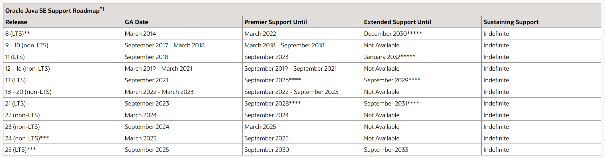
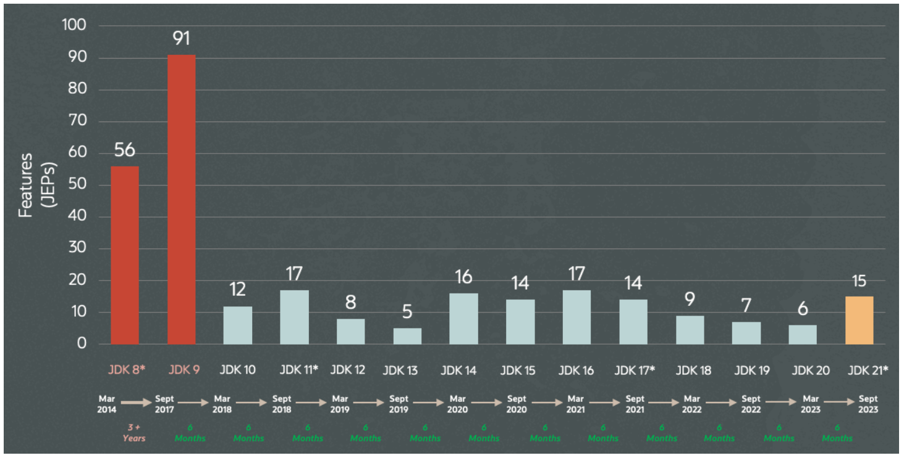
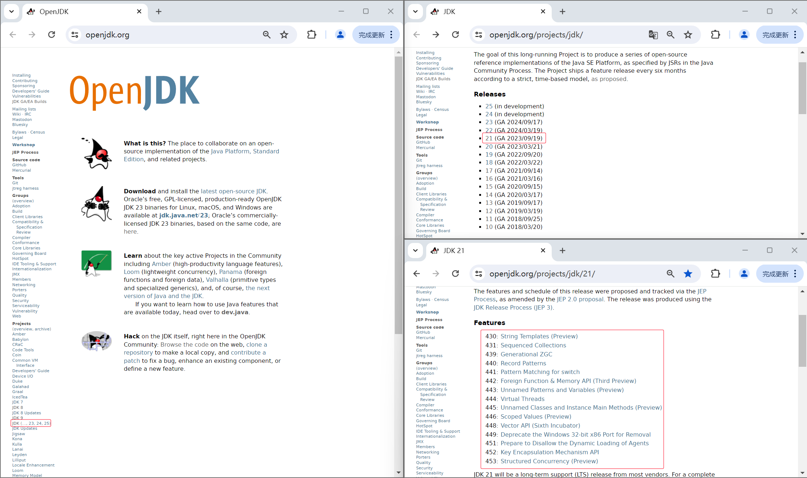
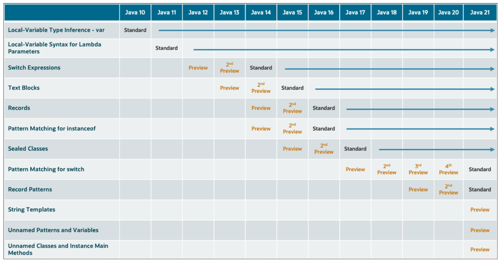

# Overview of JDK 21

JDK 21 reached General Availability on 19 September 2023. 

JDK 21 will be a long-term support (LTS) release from most vendors.

Examples of some key product dates for Oracle Java SE product offerings include:

[https://www.oracle.com/java/technologies/java-se-support-roadmap.html](https://www.oracle.com/java/technologies/java-se-support-roadmap.html)

Java moved to a 6-month, time-based release cadence in 2017 with a new feature release of Java becoming available like clockwork every March and September.

[https://dev.java/evolution/](https://dev.java/evolution/)

[https://openjdk.org/](https://openjdk.org/)

Classify the 15 JEPs in JDK21 from the perspectives of Language, API, and JVM.

| Category | JEPs                                                         |
| -------- | ------------------------------------------------------------ |
| Language | 430: [String Templates (Preview)](https://openjdk.org/jeps/430) |
|          | 440: [Record Patterns](https://openjdk.org/jeps/440)         |
|          | 441: [Pattern Matching for switch](https://openjdk.org/jeps/441) |
|          | 443: [Unnamed Patterns and Variables (Preview)](https://openjdk.org/jeps/443) |
|          | 445: [Unnamed Classes and Instance Main Methods (Preview)](https://openjdk.org/jeps/445) |
| API      | 442: [Foreign Function & Memory API (Third Preview)](https://openjdk.org/jeps/442) |
|          | 446: [Scoped Values (Preview)](https://openjdk.org/jeps/446) |
|          | 448: [Vector API (Sixth Incubator)](https://openjdk.org/jeps/448) |
|          | 452: [Key Encapsulation Mechanism API](https://openjdk.org/jeps/452) |
|          | 453: [Structured Concurrency (Preview)](https://openjdk.org/jeps/453) |
| JVM      | 431: [Sequenced Collections](https://openjdk.org/jeps/431)   |
|          | 439: [Generational ZGC](https://openjdk.org/jeps/439)        |
|          | 444: [Virtual Threads](https://openjdk.org/jeps/444)         |
|          | 449: [Deprecate the Windows 32-bit x86 Port for Removal](https://openjdk.org/jeps/449) |
|          | 451: [Prepare to Disallow the Dynamic Loading of Agents](https://openjdk.org/jeps/451) |

# Language

## String Templates

Simplify string concatenation and enhance string readability.

A preview language feature and API.

use --enable-preview to enable string templates.

Java 目前支持三种模板处理器：

- STR：自动执行字符串插值，即将模板中的每个嵌入式表达式替换为其值（转换为字符串）。
- FMT：和 STR 类似，但是它还可以接受格式说明符，这些格式说明符出现在嵌入式表达式的左边，用来控制输出的样式。
- RAW：不会像 STR 和 FMT 模板处理器那样自动处理字符串模板，而是返回一个 `StringTemplate` 对象，这个对象包含了模板中的文本和表达式的信息。

除了 JDK 自带的三种模板处理器外，你还可以实现 `StringTemplate.Processor` 接口来创建自己的模板处理器，只需要继承 `StringTemplate.Processor`接口，然后实现 `process` 方法即可。

https://openjdk.org/jeps/430

https://docs.oracle.com/javase/specs/jls/se21/preview/specs/string-templates-jls.html

# Project Amber in Action

Here is a picture that represents [Project Amber](http://openjdk.org/projects/amber/), the release cadence, and the preview system in action over the last few years. As you can see, many of Amber's language features started off as preview features to collect broader feedback, and sometimes made slight changes before becoming standard.

[https://dev.java/evolution/](https://dev.java/evolution/)
