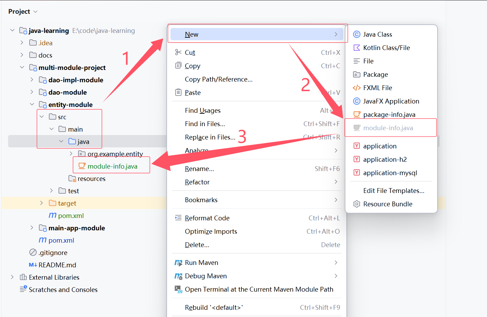

# JDK 9

## Overview

[JDK 9](https://openjdk.org/projects/jdk9/) is released on September 21, 2017.

## New Features

### Java Platform Module System

Java Platform Module System, a new kind of Java programing component, the module, which is a a uniquely named, reusable group of related packages, as well as resources (such as images and XML files) and a module descriptor。

模块化系统，简单来说，你可以将一个模块看作是一组唯一命名、可重用的包、资源和模块描述文件（module-info.java）。任意一个 jar 文件，只要加上一个模块描述文件（module-info.java），就可以升级为一个模块。


模块描述文件（module-info.java）是一个特殊的 Java 文件，位于模块的根目录下（源码目录下，Maven 项目的源码文件夹通常是 src/main/java 中的 java 文件夹）。



The `module-info.java` file is used to define a module in Java's module system, introduced in Java 9. It specifies the module's dependencies, the packages it exports, and other module-related information. Here are the key components and their usage:

**Module Declaration**: The `module` keyword is used to declare a module.

```java
module com.example.myapp {
    // Module directives go here
}
```

**Requires**: Specifies the dependencies of the module. It indicates which other modules this module depends on.

- **`requires`**: Specifies a mandatory dependency at both compile time and runtime.
- **`requires transitive`**: Specifies a mandatory dependency that is also propagated to modules that depend on the current module. The **`requires transitive`** directive specifies that not only does the current module depend on another module, but any module that depends on the current module will also implicitly depend on the transitive module.
- **`requires static`**: Specifies an optional dependency that is only required at compile time. The **`requires static`** directive specifies an optional dependency. The module is only required at compile time, not at runtime. This is useful for dependencies that are only needed during development, such as annotation processors or testing libraries.
- **`requires static transitive`**: Specifies an optional dependency that is required at compile time and is also propagated to modules that depend on the current module.

```java
module com.example.myapp {
    // Basic dependency
    requires java.sql;

    // Transitive dependency
    requires transitive java.logging;

    // Static dependency
    requires static org.junit.jupiter.api;

    // Static transitive dependency
    requires static transitive org.mockito;
}
```

**Exports**: Specifies the packages that the module makes available to other modules. Only the packages listed here can be accessed by other modules.

- **`exports`**: Specifies that a package is accessible to all other modules.
- **`exports ... to ...`**: Specifies that a package is accessible only to the specified modules.

```java
module com.example.myapp {
    // Exporting a package to all modules
    exports com.example.myapp.services;

    // Exporting a package to specific modules
    exports com.example.myapp.internal to com.example.clientapp, com.example.anotherapp;
}
```

**Uses**: Specifies a service that the module consumes. This is used in conjunction with the ServiceLoader API.

```java
uses com.example.myapp.services.MyService;
```

**Provides**: Specifies a service implementation that the module provides.

```java
provides com.example.myapp.services.MyService with com.example.myapp.services.impl.MyServiceImpl;
```

**Open**: Opens a package to allow deep reflection by other modules.

```java
opens com.example.myapp.internal to some.other.module;
```

**Open Module**: Opens all packages in the module for deep reflection.

```java
open module com.example.myapp {
    // Module directives go here
}
```

它定义了模块的名称、导出的包、依赖的其他模块以及访问控制等。基本语法：

```java
module <module-name> {
  // 需要其他模块：一个模块依赖于其他模块
  requires <module-name>;  
  // 需要其他模块（传递依赖）：简化模块之间依赖管理
  requires transitive <module-name>;  
  // 需要其他模块（静态依赖）：编译时必须存在，但运行时不一定需要，JVM解析模块时不会加载静态依赖的模块（即使不存在，也不报错）
  requires static <module-name>;  
  // 需要其他模块（静态依赖 + 传递依赖）
  requires static transitive <module-name>; 
    
  // 导出包：声明一个模块的包对其他模块可见
  exports <package-name>;
  // 导出包（定向导出）：限定将包导出到某些模块，其它模块不可访问。多个模块使用逗号分隔。
  exports <package-name> to <module-name>;
    
  // 提供服务：多个实现类使用逗号分隔。
  provides <service-interface> with <implementation-class>;
  // 使用服务
  uses <service-interface>
      
  // 打开包（允许反射访问）
  opens <package-name>;
}
```

### Multi-release JAR files

```
jar root
  - A.class
  - B.class
  - C.class
  - D.class
  - META-INF
     - versions
        - 9
           - A.class
           - B.class
        - 10
           - A.class
```

[JEP 238: Multi-Release JAR Files](http://openjdk.java.net/jeps/238) Extends the JAR file format to enable multiple, Java release-specific versions of class files to coexist in a single archive.

A multirelease JAR (MRJAR) contains additional, versioned directories for classes and resources specific to particular Java platform releases. Specify versioned directories with the [`jar`](https://docs.oracle.com/javase/9/tools/jar.htm#JSWOR-GUID-51C11B76-D9F6-4BC2-A805-3C847E857867) tool's `--release` option.

You can use the  [`jar`](https://docs.oracle.com/javase/9/tools/jar.htm#JSWOR614) command to create an archive for classes and resources, and to manipulate or restore individual classes or resources from an archive.

```shell
jar [OPTION...] [ [--release VERSION] [-C dir] files] ...
```

### JShell

[JEP 222:](http://openjdk.java.net/jeps/222) JShell The Java Shell (Read-Eval-Print Loop).The JShell tool provides an interactive command-line interface to interactively evaluate declarations, statements, and expressions of the Java programming language. See [Introduction to JShell](https://docs.oracle.com/javase/9/jshell/introduction-jshell.htm#JSHEL-GUID-630F27C8-1195-4989-9F6B-2C51D46F52C8).

JShell 是 JDK 9 新增的一个实用工具。为 Java 提供了类似于 Python 的实时命令行交互工具。

在 JShell 中可以直接输入表达式并查看其执行结果。使用 JShell，我们可以实现编程的简单测试，即写即得、快速运行。

在命令行窗口输入 `jshell` 进入Java交互式编程环境。

```shell
C:\Users\lenovo>jshell
|  欢迎使用 JShell -- 版本 9.0.4
|  要大致了解该版本, 请键入: /help intro
```

输入 `/` 后按Tab键可以查看 `jshell` 支持的命令。

```shell
jshell> /
/!          /?          /drop       /edit       /env        /exit       /help       /history    /imports    /list       /methods    /open       /reload     /reset      /save       /set
/types      /vars

<再次按 Tab 可查看提要>
```

输入 `/<command> -` 后按Tab键可以查看 该命令支持的命令选项。

```shell
jshell> /list -
-all       -history   -start

<再次按 Tab 可查看提要>
```

### HTTP/2 Client

[JEP 110](https://openjdk.org/jeps/110): HTTP/2 Client (Incubator)

In JDK 9, the `HttpClient` API was introduced as an incubator module under the `java.net.http` package. This APl provides a modern, efficient, and feature-rich HTTP client for sending HTTP requests and receiving HTTP responses. It supports both synchronous and asynchronous programming models. The API is designed to replace the legacy `HttpURLConnection` class and provides a more modern and flexible approach to handling HTTP communications.

Key Features of `HttpClient` in JDK 9

1. **Synchronous and Asynchronous Requests**: Supports both blocking and non-blocking operations. Non-blocking requests using `CompletableFuture`.
2. **HTTP/2 Support**: Provides support for HTTP/2, which allows for multiplexing multiple requests over a single connection. Automatically negotiates HTTP/2 if the server supports it.
3. **WebSocket Support**: Includes support for WebSocket communication.
4. **Builder Pattern**: Uses a builder pattern to create `HttpClient` and `HttpRequest` instances.
5. **lmproved Performance**: Designed to be more efficient and performant compared to the older `HttpURLConnection`.
5. **Customizable**: Allows configuration of timeouts, redirections, and more.

Here is a simple example of how to use the HTTP Client API in JDK 9:

```java
import java.net.URI;
import java.net.http.HttpClient;
import java.net.http.HttpRequest;
import java.net.http.HttpResponse;

public class HttpClientExample {
    public static void main(String[] args) throws Exception {
        // Create an HttpClient
        HttpClient client = HttpClient.newHttpClient();

        // Create a request
        HttpRequest request = HttpRequest.newBuilder()
                .uri(new URI("https://api.github.com"))
                .GET()
                .build();

        // Send the request and get the response
        HttpResponse<String> response = client.send(request, HttpResponse.BodyHandlers.ofString());

        // Print the response status code and body
        System.out.println("Status code: " + response.statusCode());
        System.out.println("Response body: " + response.body());
    }
}
```

The API also supports asynchronous requests using `CompletableFuture`. Here is an example:

```java
import java.net.URI;
import java.net.http.HttpClient;
import java.net.http.HttpRequest;
import java.net.http.HttpResponse;
import java.util.concurrent.CompletableFuture;

public class AsyncHttp2ClientExample {
    public static void main(String[] args) throws Exception {
        // Create an HttpClient with HTTP/2 support
        HttpClient client = HttpClient.newBuilder()
                .version(HttpClient.Version.HTTP_2)
                .build();

        // Create a request
        HttpRequest request = HttpRequest.newBuilder()
                .uri(new URI("https://http2.github.io/"))
                .GET()
                .build();

        // Send the request asynchronously
        CompletableFuture<HttpResponse<String>> responseFuture = client.sendAsync(request, HttpResponse.BodyHandlers.ofString());

        // Print the response status code and body when the response is received
        responseFuture.thenAccept(response -> {
            System.out.println("Status code: " + response.statusCode());
            System.out.println("Response body: " + response.body());
        }).join();
    }
}
```

**Explanation**

1. **HttpClient**: The `HttpClient` class is used to create an HTTP client instance. lt can be configured with various options such as HTTP version,connection timeout, etc.
2. **HttpRequest**: The `HttpRequest` class is used to create an HTTP request. It can be confiqured with the request method (GET, POST, etc),URL, headers, and body.
3. **HttpResponse**: The `HttpResponse` class represents the response received from the server. It contains the status code, headers, and body of the response.
4. **Synchronous Request**: The `send` method is used to send a synchronous request and receive the response
4. **Asynchronous Request**: The `sendAsync` method is used to send an asynchronous request and receive the response as a `CompletableFuture`

### Unified JVM and GC Logging

[JEP 158](https://openjdk.org/jeps/158): Unified JVM Logging

[JEP 271](https://openjdk.org/jeps/271): Unified GC Logging

## Enhancements

### private methods of interfaces

Private interface methods are supported. This support allows nonabstract methods of an interface to share code between them.

Java 9 允许在接口中使用私有方法。

| JDK   | Feature                          |
| ----- | -------------------------------- |
| JDK 7 | 在接口中仅支持全局常量、抽象方法 |
| JDK 8 | 在接口中支持静态方法、默认方法   |
| JDK 9 | 在接口中支持私有方法             |

### try-with-resources

Allow effectively final variables to be used as resources in the `try-with-resources` statement.

```java
// A final resource
final Resource resource1 = new Resource("resource1");
// An effectively final resource
Resource resource2 = new Resource("resource2");

// In Java SE 7 or 8, you would declare new variables, like this:
// 在 Java 9 之前，我们只能在 try-with-resources 块中声明变量：
try (Resource r1 = resource1;
     Resource r2 = resource2) {
    ...
}

// New and improved try-with-resources statement in Java SE 9
// 在 Java 9 之后，在 try-with-resources 语句中可以使用 effectively-final 变量。
// effectively-final 变量是没有被 final 修饰但是值在初始化后从未更改的变量。
try (resource1;
     resource2) {
    ...
}
```

## Reference

[https://openjdk.org/projects/jdk9/](https://openjdk.org/projects/jdk9/)

[https://docs.oracle.com/javase/9/](https://docs.oracle.com/javase/9/)

[https://www.oracle.com/java/technologies/javase/9-relnotes.html](http://www.oracle.com/technetwork/java/javase/9-relnotes-3622618.html)

[https://www.oracle.com/java/technologies/javase/9-all-relnotes.html](https://www.oracle.com/java/technologies/javase/9-all-relnotes.html)

[https://blogs.oracle.com/java/post/jdk-9-is-released](https://blogs.oracle.com/java/post/jdk-9-is-released)

[https://javaguide.cn/java/](https://javaguide.cn/java/)


