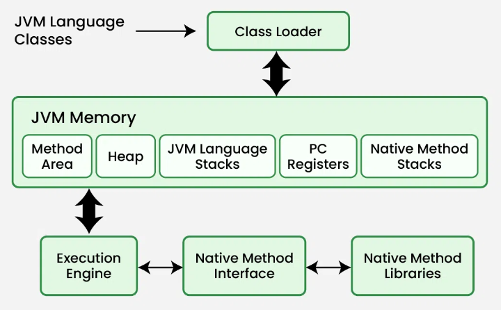
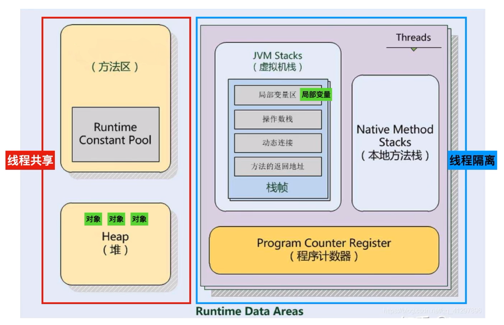
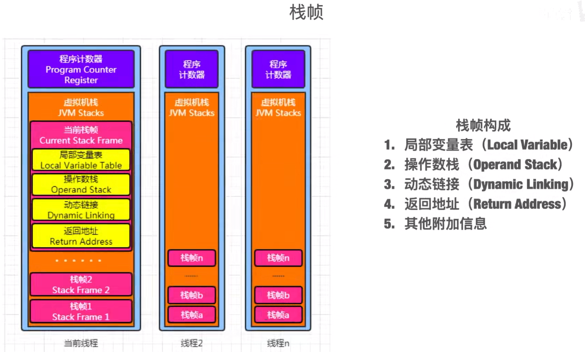

JVM(Java Virtual Machine) runs Java applications as a run-time engine. JVM is the one that calls the main method present in a Java code. JVM is a part of JRE(Java Runtime Environment).

Java applications are called WORA (Write Once Run Anywhere). This means a programmer can develop Java code on one system and expect it to run on any other Java-enabled system without any adjustment. This is all possible because of JVM.

When we compile a .java file, .class files(contains byte-code) with the same class names present in .java file are generated by the Java compiler. This .class file goes into various steps when we run it. These steps together describe the whole JVM. 

# The Java HotSpot VM







# Tools

**javac**: 将源代码文件编译为字节码文件

```shell
javac [options] [sourcefiles]
```

**javap**: 反编译字节码文件（即对javac编译的文件进行反编译）

```shell
javap [options] classes...

# -c: Prints disassembled code, for example, the instructions that comprise the Java bytecodes, for each of the methods in the class.
# -l: Prints line and local variable tables.
javap -c -l classes...
```

**java**: 执行字节码文件

```shell
# To launch a class file:
java [options] mainclass [args...] 

# To launch the main class in a JAR file:
java [options] -jar jarfile [args...]
```

[https://docs.oracle.com/en/java/javase/11/tools/main-tools-create-and-build-applications.html](https://docs.oracle.com/en/java/javase/11/tools/main-tools-create-and-build-applications.html)

**jclasslib** is a bytecode viewer for Java class files.

[https://github.com/ingokegel/jclasslib](https://github.com/ingokegel/jclasslib)

[https://plugins.jetbrains.com/plugin/9248-jclasslib](https://plugins.jetbrains.com/plugin/9248-jclasslib)

# Reference

[The Java HotSpot Performance Engine Architecture](https://www.oracle.com/java/technologies/whitepaper.html)

[Memory Management in the Java HotSpot Virtual Machine](https://www.oracle.com/docs/tech/java/memorymanagement-technical-brief.pdf)

[The Java HotSpot VM - OpenJDK](https://cr.openjdk.org/~thartmann/talks/2017-Hotspot_Under_The_Hood.pdf)

[How JVM Works – JVM Architecture](https://www.geeksforgeeks.org/jvm-works-jvm-architecture/)