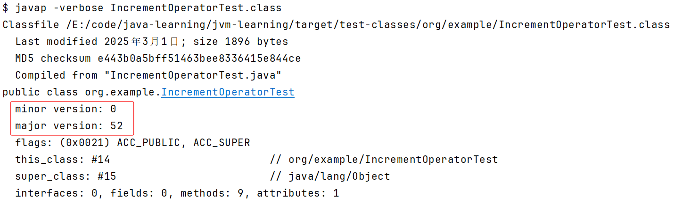

# The mapping between class file versions and JDK versions

Java class files have a major and minor version number. The major version indicates which Java VM can execute the class file, while the minor version is 0 for every relevant Java version. The class file format is typically changed with a new release of Java.

Java类文件有主版本号和次版本号。主版本指示哪个Java VM可以执行类文件，而次版本对于每个相关的Java版本都是0。类文件格式通常会随着Java的新版本而改变。

Each JDK Release comes with its class file version. Class files are backward compatible. But class files compiled for newer JDK releases cannot be executed and will result in an `UnsupportedClassVersionError`.

每个JDK版本都有其类文件版本。类文件向后兼容。但是，为较新JDK版本编译的类文件无法执行，并将导致不支持的ClassVersionError。

The following table lists class file versions for each JDK release. You can refer to [https://javaalmanac.io/bytecode/versions/](https://javaalmanac.io/bytecode/versions/) for details.

| JDK Version                                 | Class File Version |
| :------------------------------------------ | :----------------- |
| [Java 1.0](https://javaalmanac.io/jdk/1.0/) | 45.0               |
| [Java 1.1](https://javaalmanac.io/jdk/1.1/) | 45.3               |
| [Java 1.2](https://javaalmanac.io/jdk/1.2/) | 46.0               |
| [Java 1.3](https://javaalmanac.io/jdk/1.3/) | 47.0               |
| [Java 1.4](https://javaalmanac.io/jdk/1.4/) | 48.0               |
| [Java 5](https://javaalmanac.io/jdk/5/)     | 49.0               |
| [Java 6](https://javaalmanac.io/jdk/6/)     | 50.0               |
| [Java 7](https://javaalmanac.io/jdk/7/)     | 51.0               |
| [Java 8](https://javaalmanac.io/jdk/8/)     | 52.0               |
| [Java 9](https://javaalmanac.io/jdk/9/)     | 53.0               |
| [Java 10](https://javaalmanac.io/jdk/10/)   | 54.0               |
| [Java 11](https://javaalmanac.io/jdk/11/)   | 55.0               |
| [Java 12](https://javaalmanac.io/jdk/12/)   | 56.0               |
| [Java 13](https://javaalmanac.io/jdk/13/)   | 57.0               |
| [Java 14](https://javaalmanac.io/jdk/14/)   | 58.0               |
| [Java 15](https://javaalmanac.io/jdk/15/)   | 59.0               |
| [Java 16](https://javaalmanac.io/jdk/16/)   | 60.0               |
| [Java 17](https://javaalmanac.io/jdk/17/)   | 61.0               |
| [Java 18](https://javaalmanac.io/jdk/18/)   | 62.0               |
| [Java 19](https://javaalmanac.io/jdk/19/)   | 63.0               |
| [Java 20](https://javaalmanac.io/jdk/20/)   | 64.0               |
| [Java 21](https://javaalmanac.io/jdk/21/)   | 65.0               |
| [Java 22](https://javaalmanac.io/jdk/22/)   | 66.0               |
| [Java 23](https://javaalmanac.io/jdk/23/)   | 67.0               |
| [Java 24](https://javaalmanac.io/jdk/24/)   | 68.0               |
| [Java 25](https://javaalmanac.io/jdk/25/)   | 69.0               |

# How to Determine the JDK Version of a Compiled Java Class File?

Java class files contain a magic number and version information that specifies the JDK version they were compiled with. 

Different JDK versions introduce new language features and library enhancements.

Here are various methods to retrieve  class file version:

- Utilize the `java.nio.file.Files` API to read the class file and extract version information.

  ```java
  import java.io.*;
  import java.nio.file.*;
  
  public class JdkVersionChecker {
      public static void main(String[] args) throws IOException {
          Path path = Paths.get("YourClassFile.class");
          byte[] classFileBytes = Files.readAllBytes(path);
  
          // Extracting version from the byte array
          int majorVersion = (((classFileBytes[6] & 0xff) << 8) + (classFileBytes[7] & 0xff));
          System.out.println("Compiled with JDK version: " + majorVersion);
      }
  }
  ```

- Write a simple Java method using the `ClassFileReader` library to programmatically read class file versions.

  ```xml
  <dependency>
      <groupId>org.apache.bcel</groupId>
      <artifactId>bcel</artifactId>
      <version>6.5.0</version>
  </dependency>
  ```

  ```java
  import org.apache.bcel.classfile.ClassParser;
  import org.apache.bcel.classfile.JavaClass;
  
  import java.io.IOException;
  
  public class ClassFileVersionReader {
  
      public static void main(String[] args) {
          try {
              String classFilePath = "path/to/YourClass.class";
              int version = getClassFileVersion(classFilePath);
              System.out.println("Class file version: " + version);
          } catch (IOException e) {
              e.printStackTrace();
          }
      }
  
      public static int getClassFileVersion(String classFilePath) throws IOException {
          ClassParser parser = new ClassParser(classFilePath);
          JavaClass javaClass = parser.parse();
          return javaClass.getMajor();
      }
  }
  ```

- Use the Java `javap` tool to inspect the class file version directly from the command line.

  ```shell
  javap -verbose /path/to/file.class
  ```

  

- Class files are binary files, and their version can be checked using a hex editor. Open with Notepad++ and view files in hexadecimal format. (Need to install plugin HEX-Editor)

  

# How to Determine the JDK Version of a jars?

A jar file in the Java ecosystem consists of a collection of class files bundled together. In order to find out which Java version the jars are built or compiled, we can extract the jar file and use either javap or hexdump to check the .class file versions.

There is also a MANIFEST.MF file in the jar file, which contains some header information about the JDK used.

For example, the Build-Jdk or Created-By header stores the JDK value depending on how the jar is built:

```
Build-Jdk: 17.0.4
```

```
Created-By: 17.0.4
```

# Structure of a Class File

A `class` file consists of a single `ClassFile` structure:

```
ClassFile {
    u4             magic;
    u2             minor_version;
    u2             major_version;
    u2             constant_pool_count;
    cp_info        constant_pool[constant_pool_count-1];
    u2             access_flags;
    u2             this_class;
    u2             super_class;
    u2             interfaces_count;
    u2             interfaces[interfaces_count];
    u2             fields_count;
    field_info     fields[fields_count];
    u2             methods_count;
    method_info    methods[methods_count];
    u2             attributes_count;
    attribute_info attributes[attributes_count];
}
```

[https://docs.oracle.com/javase/specs/jvms/se21/html/jvms-4.html](https://docs.oracle.com/javase/specs/jvms/se21/html/jvms-4.html)

[https://docs.oracle.com/javase/specs/jvms/se17/html/jvms-4.html](https://docs.oracle.com/javase/specs/jvms/se17/html/jvms-4.html)

[https://docs.oracle.com/javase/specs/jvms/se8/html/jvms-4.html](https://docs.oracle.com/javase/specs/jvms/se8/html/jvms-4.html)

# Java Bytecode

A Java Virtual Machine instruction consists of an opcode specifying the operation to be performed, followed by zero or more operands embodying values to be operated upon. This chapter gives details about the format of each Java Virtual Machine instruction and the operation it performs.

Java 的字节码指令由操作码（ Opcode ）和操作数（ Operands ）组成。

- 操作码（Opcode）：指令的类型。一个字节长度（0-255，意味着指令集的操作码总数不可能超过 256 条），代表着某种特定的操作含义。
- 操作数（Operands）：指令的具体参数。零个或者多个，紧跟在操作码之后，代表此操作需要的参数。

Java 字节码指令主要分为以下几类：

- 加载和存储指令：如 aload、istore 等，用于操作栈帧中的局部变量和操作数栈。
- 算术指令：如 iadd、imul 等，用于执行基本的算术运算。
- 类型转换指令：如 i2f、f2d 等，用于不同数据类型之间的转换。
- 对象创建与操作指令：如 new、getfield 等，用于创建对象和访问对象的字段。
- 方法调用与返回指令：如 invokevirtual、return 等，用于方法的调用和返回。
- 操作数栈管理指令
- 控制转移指令

[https://javaalmanac.io/bytecode/opcodes/](https://javaalmanac.io/bytecode/opcodes/)

[https://docs.oracle.com/javase/specs/jvms/se8/html/jvms-6.html](https://docs.oracle.com/javase/specs/jvms/se8/html/jvms-6.html)

[https://javabetter.cn/jvm/zijiema-zhiling.html](https://javabetter.cn/jvm/zijiema-zhiling.html)


# Reference

[https://docs.oracle.com/javase/specs/index.html](https://docs.oracle.com/javase/specs/index.html)

[https://javaalmanac.io/](https://javaalmanac.io/)

