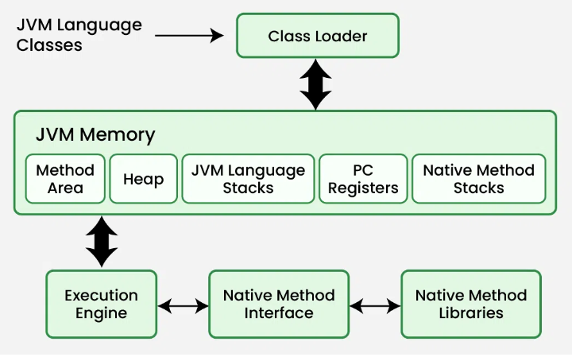
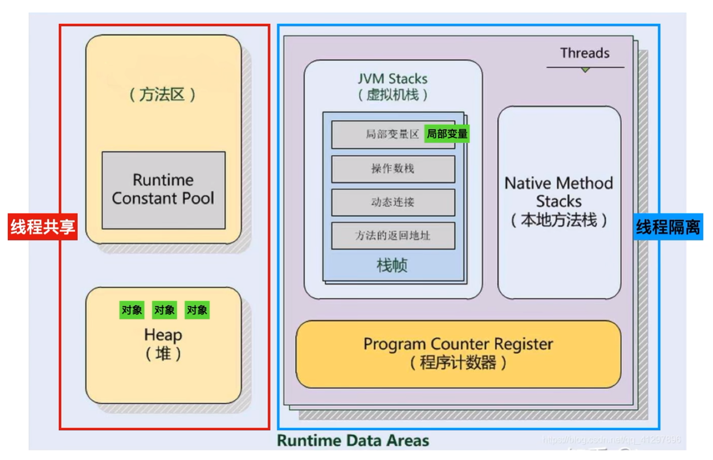
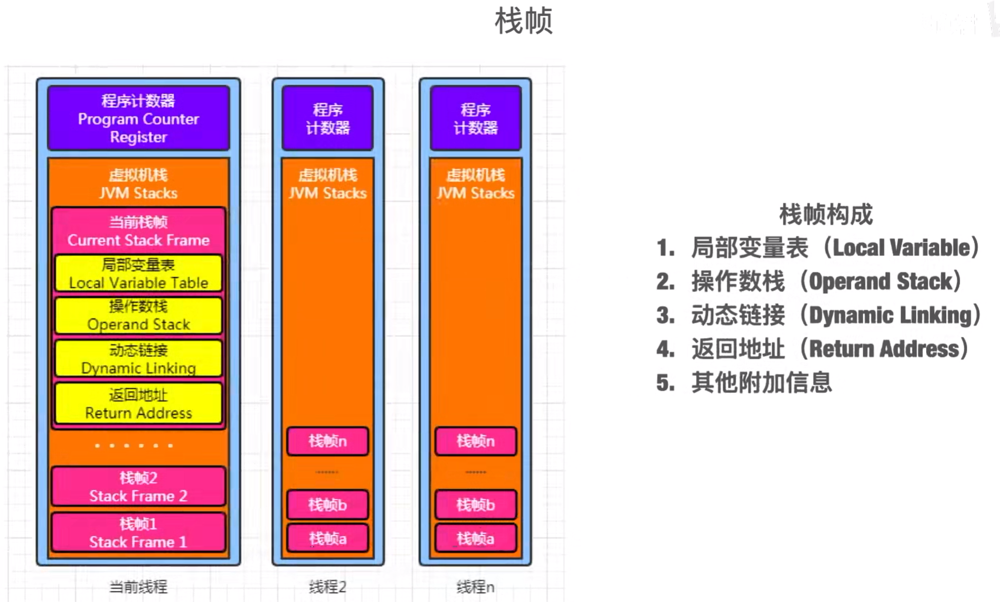

# JVM

JVM(Java Virtual Machine) runs Java applications as a run-time engine. 

JVM is the one that calls the main method present in a Java code. JVM is a part of JRE(Java Runtime Environment).

Java applications are called WORA (Write Once Run Anywhere). This means a programmer can develop Java code on one system and expect it to run on any other Java-enabled system without any adjustment. This is all possible because of JVM.

## JVM implementations

Here is an overview of the major JVM (Java Virtual Machine) implementations:

### 1. **HotSpot JVM**

- **Maintained by**: Oracle (and used in OpenJDK).
- **Description**: The most widely used JVM implementation. It is the default JVM for OpenJDK and Oracle JDK.
- Key Features:
  - Advanced Just-In-Time (JIT) compilers: C1 (client) and C2 (server).
  - Garbage collectors: Serial, Parallel, CMS, G1, ZGC, Shenandoah.
  - Highly optimized for performance and compatibility.
- **Use Cases**: General-purpose JVM for most Java applications.
- Website: [OpenJDK](vscode-file://vscode-app/d:/Microsoft VS Code/resources/app/out/vs/code/electron-sandbox/workbench/workbench.html)

------

### 2. **OpenJ9**

- **Maintained by**: Eclipse Foundation (originally developed by IBM).
- **Description**: A lightweight, modular JVM designed for cloud and containerized environments.
- Key Features:
  - Smaller memory footprint compared to HotSpot.
  - Fast startup times.
  - Supports multiple garbage collectors, including balanced GC.
- **Use Cases**: Applications requiring low memory usage and fast startup, such as microservices.
- Website: [Eclipse OpenJ9](vscode-file://vscode-app/d:/Microsoft VS Code/resources/app/out/vs/code/electron-sandbox/workbench/workbench.html)
- Repository: [GitHub - Eclipse OpenJ9](vscode-file://vscode-app/d:/Microsoft VS Code/resources/app/out/vs/code/electron-sandbox/workbench/workbench.html)

------

### 3. **GraalVM**

- **Maintained by**: Oracle.
- **Description**: A high-performance JVM with support for polyglot programming (e.g., JavaScript, Python, Ruby, R).
- Key Features:
  - Ahead-Of-Time (AOT) compilation for native images.
  - Polyglot runtime for multiple languages.
  - Optimized JIT compiler (Graal JIT) for better performance.
- **Use Cases**: High-performance applications, polyglot programming, and native image generation.
- Website: [GraalVM](vscode-file://vscode-app/d:/Microsoft VS Code/resources/app/out/vs/code/electron-sandbox/workbench/workbench.html)
- Repository: [GitHub - GraalVM](vscode-file://vscode-app/d:/Microsoft VS Code/resources/app/out/vs/code/electron-sandbox/workbench/workbench.html)

------

### 4. **Zulu JVM**

- **Maintained by**: Azul Systems.
- **Description**: A certified build of OpenJDK with additional support and optimizations.
- Key Features:
  - Fully compatible with OpenJDK.
  - Azul's proprietary garbage collector (C4 - Continuously Concurrent Compacting Collector).
- **Use Cases**: Enterprise applications requiring long-term support and advanced GC.
- Website: [Azul Zulu](vscode-file://vscode-app/d:/Microsoft VS Code/resources/app/out/vs/code/electron-sandbox/workbench/workbench.html)

------

### 5. **Amazon Corretto**

- **Maintained by**: Amazon.
- **Description**: A free, production-ready distribution of OpenJDK with long-term support.
- Key Features:
  - Fully compatible with OpenJDK.
  - Optimized for AWS environments.
- **Use Cases**: Cloud-native applications, especially on AWS.
- Website: [Amazon Corretto](vscode-file://vscode-app/d:/Microsoft VS Code/resources/app/out/vs/code/electron-sandbox/workbench/workbench.html)

------

### 6. **Liberica JDK**

- **Maintained by**: BellSoft.
- **Description**: A full OpenJDK distribution with additional tools and support for embedded systems.
- Key Features:
  - Support for JavaFX and other optional modules.
  - Optimized for embedded and IoT devices.
- **Use Cases**: Applications requiring JavaFX or running on embedded systems.
- Website: [Liberica JDK](vscode-file://vscode-app/d:/Microsoft VS Code/resources/app/out/vs/code/electron-sandbox/workbench/workbench.html)

------

### 7. **Dragonwell**

- **Maintained by**: Alibaba.
- **Description**: A downstream distribution of OpenJDK optimized for large-scale, distributed systems.
- Key Features:
  - Optimizations for Alibaba's cloud and e-commerce platforms.
  - Enhanced diagnostics and monitoring tools.
- **Use Cases**: Large-scale distributed systems and cloud-native applications.
- Website: [Alibaba Dragonwell](vscode-file://vscode-app/d:/Microsoft VS Code/resources/app/out/vs/code/electron-sandbox/workbench/workbench.html)
- Repository: [GitHub - Dragonwell](vscode-file://vscode-app/d:/Microsoft VS Code/resources/app/out/vs/code/electron-sandbox/workbench/workbench.html)

------

### 8. **Microsoft Build of OpenJDK**

- **Maintained by**: Microsoft.
- **Description**: A free, open-source distribution of OpenJDK tailored for Azure and Microsoft services.
- Key Features:
  - Fully compatible with OpenJDK.
  - Optimized for Azure environments.
- **Use Cases**: Java applications running on Microsoft Azure.
- Website: [Microsoft Build of OpenJDK](vscode-file://vscode-app/d:/Microsoft VS Code/resources/app/out/vs/code/electron-sandbox/workbench/workbench.html)
- Repository: [GitHub - Microsoft OpenJDK](vscode-file://vscode-app/d:/Microsoft VS Code/resources/app/out/vs/code/electron-sandbox/workbench/workbench.html)

------

### 9. **Red Hat OpenJDK**

- **Maintained by**: Red Hat.
- **Description**: A downstream distribution of OpenJDK with enterprise support.
- Key Features:
  - Fully compatible with OpenJDK.
  - Long-term support and security updates.
- **Use Cases**: Enterprise applications requiring stability and support.
- Website: [Red Hat OpenJDK](vscode-file://vscode-app/d:/Microsoft VS Code/resources/app/out/vs/code/electron-sandbox/workbench/workbench.html)

------

### 10. **Avian**

- **Maintained by**: ReadyTalk (open-source project).
- **Description**: A lightweight JVM designed for small devices and embedded systems.
- Key Features:
  - Small memory footprint.
  - Ahead-Of-Time (AOT) compilation.
- **Use Cases**: Embedded systems and resource-constrained environments.
- Website: [Avian JVM](vscode-file://vscode-app/d:/Microsoft VS Code/resources/app/out/vs/code/electron-sandbox/workbench/workbench.html)
- Repository: [GitHub - Avian](vscode-file://vscode-app/d:/Microsoft VS Code/resources/app/out/vs/code/electron-sandbox/workbench/workbench.html)

------

### Summary Table

| JVM         | Maintainer         | Key Features                     | Use Cases                       |
| ----------- | ------------------ | -------------------------------- | ------------------------------- |
| HotSpot     | Oracle/OpenJDK     | Advanced JIT, multiple GCs       | General-purpose applications    |
| OpenJ9      | Eclipse Foundation | Lightweight, fast startup        | Cloud, microservices            |
| GraalVM     | Oracle             | Polyglot, AOT compilation        | High-performance, polyglot apps |
| Zulu        | Azul Systems       | C4 GC, enterprise support        | Enterprise applications         |
| Corretto    | Amazon             | AWS-optimized, long-term support | Cloud-native apps on AWS        |
| Liberica    | BellSoft           | JavaFX, embedded support         | IoT, embedded systems           |
| Dragonwell  | Alibaba            | Distributed system optimizations | Large-scale distributed systems |
| MS OpenJDK  | Microsoft          | Azure-optimized                  | Java apps on Azure              |
| Red Hat JDK | Red Hat            | Enterprise support               | Enterprise applications         |
| Avian       | ReadyTalk          | Lightweight, AOT                 | Embedded systems                |

Each JVM has its own strengths and is suited for specific use cases.

## How the JVM works

The Java Virtual Machine (JVM) is a runtime environment that executes Java bytecode. Here's a step-by-step explanation of how the JVM works:

------

**1. Compilation to Bytecode**

- Java source code (`.java` files) is compiled by the **Java Compiler (`javac`)** into **bytecode** (`.class` files).
- Bytecode is platform-independent and serves as an intermediate representation of the program.

------

**2. Class Loading**

- The JVM uses the **Class Loader Subsystem** to load `.class` files into memory.
- The class loader performs:
  - **Loading**: Reads `.class` files from disk or network.
  - **Linking**: Verifies bytecode, prepares static fields, and resolves references.
  - **Initialization**: Executes static initializers and assigns default values to static variables.

------

**3. Bytecode Execution**

The JVM executes bytecode using the following components:

**a. Execution Engine**

- The execution engine is responsible for running the bytecode.
- It uses two main techniques:
  1. Interpretation:
     - The bytecode is interpreted line-by-line by the JVM.
     - This is slower because each instruction is translated at runtime.
  2. Just-In-Time (JIT) Compilation:
     - Frequently used bytecode is compiled into native machine code for faster execution.
     - The compiled code is cached for reuse.

**b. Native Method Interface (JNI)**

- If the program calls native code (e.g., C/C++ libraries), the JVM uses the **Java Native Interface (JNI)** to interact with the native system.

------

**4. Memory Management**

The JVM manages memory using the **Java Memory Model**, which is divided into several regions:

**a. Heap**

- Stores objects and class-level variables.
- Managed by the **Garbage Collector (GC)** to automatically free unused memory.

**b. Stack**

- Stores method call frames, local variables, and partial results.
- Each thread has its own stack.

**c. Method Area**

- Stores class metadata, static variables, and method bytecode.

**d. Program Counter (PC) Register**

- Keeps track of the current instruction being executed for each thread.

**e. Native Method Stack**

- Stores information for native method calls.

------

**5. Garbage Collection**

- The JVM automatically manages memory using **Garbage Collection (GC)**.
- GC identifies and removes objects that are no longer referenced to free up memory.
- Common garbage collectors include:
  - **Serial GC**: Single-threaded.
  - **Parallel GC**: Multi-threaded.
  - **G1 GC**: Low-latency, region-based.
  - **ZGC** and **Shenandoah GC**: Ultra-low-latency collectors.

------

**6. Thread Management**

- The JVM supports multithreading by managing threads at the OS level.
- Each thread has its own stack and program counter.
- Synchronization and thread safety are handled using Java's concurrency utilities.

------

**7. Execution Flow**

1. **Start**: The JVM starts by invoking the `main` method of the specified class.
2. **Class Loading**: The required classes are loaded into memory.
3. **Bytecode Execution**: The execution engine interprets or compiles the bytecode.
4. **Garbage Collection**: Unused objects are cleaned up during execution.
5. **End**: The program terminates when the `main` method completes or when `System.exit()` is called.

------

**Diagram of JVM Workflow**

```
  Java Source Code (.java)
    ↓
  Compiler (javac)
    ↓
  Bytecode (.class)
    ↓
  Class Loader
    ↓
  Execution Engine
  (Interpreter + JIT)
    ↓
  Native Code Execution
```

------

**Key Features of JVM**

- **Platform Independence**: Bytecode can run on any platform with a compatible JVM.
- **Automatic Memory Management**: Garbage collection eliminates manual memory management.
- **Security**: Bytecode verification ensures safe execution.
- **Performance Optimization**: JIT compilation and adaptive optimizations improve runtime performance.

The JVM is the core of Java's "write once, run anywhere" philosophy, enabling portability and efficient execution.

[How JVM Works – JVM Architecture](https://www.geeksforgeeks.org/jvm-works-jvm-architecture/)







## JVM Tools

The main command to interact with a JVM is typically the `java` command, which is used to run Java applications. Here’s an overview of its usage:

**Basic Syntax**

```shell
java [options] class [args...]
```

- **`options`**: JVM options or arguments (e.g., memory settings, garbage collection settings).
- **`class`**: The fully qualified name of the class containing the `public static void main(String[] args)` method.
- **`args...`**: Arguments passed to the `main` method of the class.

------

**Commonly Used Commands**

1. **Run a Java Program**

   ```shell
   # To launch a class file:
   # java [options] mainclass [args...] 
   
   java MyClass
   ```

   Runs the `MyClass` program (must have a `main` method).

2. **Run a JAR File**

   ```shell
   # To launch the main class in a JAR file:
   # java [options] -jar jarfile [args...]
   
   java -jar myapp.jar
   ```

   Executes a Java application packaged in a JAR file.

3. **Set Memory Options**

   ```shell
   java -Xms512m -Xmx1024m MyClass
   ```

   - `-Xms`: Sets the initial heap size.
   - `-Xmx`: Sets the maximum heap size.

4. **Enable Garbage Collection Logging**

   ```shell
   java -XX:+PrintGCDetails MyClass
   ```

   Enables detailed garbage collection logs.

5. **Specify a Garbage Collector**

   ```shell
   java -XX:+UseG1GC MyClass
   ```

   - `-XX:+UseG1GC`: Use the G1 Garbage Collector.
   - Other options: `-XX:+UseParallelGC`, `-XX:+UseZGC`, `-XX:+UseShenandoahGC`.

6. **Enable JIT Compiler Options**

   ```shell
   java -XX:+TieredCompilation MyClass
   ```

   Enables tiered compilation for better performance.

7. **Debugging**

   ```shell
   java -agentlib:jdwp=transport=dt_socket,server=y,suspend=n,address=*:5005 MyClass
   ```

   Starts the JVM in debug mode, listening on port 5005.

8. **Version Information**

   ```shell
   java -version
   ```

   Displays the installed Java version.

9. **Help**

   ```shell
   java -help
   ```

   Displays a list of available options and usage.

------

**Other JVM Tools**

In addition to the `java` command, the JVM provides other tools for specific tasks:

- **`javac`**: Compiles Java source code into bytecode. 将源代码文件编译为字节码文件

  ```shell
  javac [options] [sourcefiles]
  ```

- **`javadoc`**: Generates documentation from Java source code.

- **`jconsole`**: Monitors JVM performance.

- **`jstack`**: Prints thread stack traces.

- **`jmap`**: Prints memory maps and heap information.

- **`jstat`**: Monitors JVM statistics.

- **`javap`**: 反编译字节码文件（即对javac编译的文件进行反编译）

  ```shell
  javap [options] classes...
  
  # -c: Prints disassembled code, for example, the instructions that comprise the Java bytecodes, for each of the methods in the class.
  # -l: Prints line and local variable tables.
  javap -c -l classes...
  ```

- **`jclasslib`** is a bytecode viewer for Java class files.

[https://docs.oracle.com/en/java/javase/11/tools/main-tools-create-and-build-applications.html](https://docs.oracle.com/en/java/javase/11/tools/main-tools-create-and-build-applications.html)

[https://github.com/ingokegel/jclasslib](https://github.com/ingokegel/jclasslib)

[https://plugins.jetbrains.com/plugin/9248-jclasslib](https://plugins.jetbrains.com/plugin/9248-jclasslib)

## Reference

[https://openjdk.org/groups/hotspot/](https://openjdk.org/groups/hotspot/)

[https://openjdk.org/groups/hotspot/docs/RuntimeOverview.html](https://openjdk.org/groups/hotspot/docs/RuntimeOverview.html)

[The Java HotSpot Performance Engine Architecture](https://www.oracle.com/java/technologies/whitepaper.html)

[Memory Management in the Java HotSpot Virtual Machine](https://www.oracle.com/docs/tech/java/memorymanagement-technical-brief.pdf)

[The Java HotSpot VM - OpenJDK](https://cr.openjdk.org/~thartmann/talks/2017-Hotspot_Under_The_Hood.pdf)

[https://www.infoworld.com/article/2269370/what-is-the-jvm-introducing-the-java-virtual-machine.html](https://www.infoworld.com/article/2269370/what-is-the-jvm-introducing-the-java-virtual-machine.html)

[https://www.fineconstant.com/posts/comparing-jvm-performance/](https://www.fineconstant.com/posts/comparing-jvm-performance/)