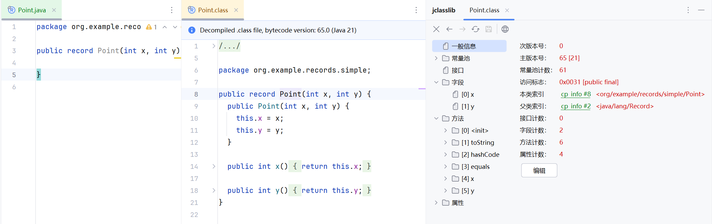

# Records

## JEP 359: Records (Preview) - JDK 14

Records were proposed by [JEP 359](https://openjdk.java.net/jeps/359) and delivered in [JDK 14](https://openjdk.java.net/projects/jdk/14) as a preview language feature.

Records were intended to provide a concise way to define immutable data carriers.

Consider your typical `Point` class that represents a point on a plane, with an x and a y coordinate.

Prior to Java 14:

```java
public class Point {

    int x;
    int y;

    public Point(int x, int y) {
        this.x = x;
        this.y = y;
    }

    public int getX() {
        return x;
    }

    public int getY() {
        return y;
    }

    @Override
    public boolean equals(Object o) {
        if (o == null || getClass() != o.getClass()) {
            return false;
        }
        Point point = (Point) o;
        return x == point.x && y == point.y;
    }

    @Override
    public int hashCode() {
        return Objects.hash(x, y);
    }

    @Override
    public String toString() {
        return "Point{" +
            "x=" + x +
            ", y=" + y +
            '}';
    }
}
```

As Of Java 14:

```java
public record Point(int x, int y) {

}
```

In IDEA, compile Point.java, select Point.class, View -> Show Bytecode With Jclasslib



Records are implicitly final, cannot be abstract, and cannot extend any other class, but can implement interfaces.

Automatically generate public constructor methods that accept all declared fields as parameters.

Each declared field corresponds to the private final member of Record, and provides a getter method with the same name and type as the declared field externally.

Automatically generated `equals()`, `hashCode()`, and `toString()` methods.

Cannot declare instance fields, may declare static methods, static fields, static initializers, constructors, instance methods, and nested types.

The constructor may be declared without a formal parameter list, an explicit canonical constructor to perform only validation and normalization of its parameters.

```java
public record Point(int x, int y) {

  public Point {
    if (x < 0) {
      throw new IllegalArgumentException("x must be grater or equals 0");
    }
    if (y < 0) {
      throw new IllegalArgumentException("y must be grater or equals 0");
    }
  }
}
```

## JEP 384: Records (Second Preview) - JDK 15

